# Lab - 3D: What You Need to Know
## Part One: Creating and Importing 3D Models and Animations

### Introduction

This lab will serve as a very basic introduction to the information you need to know to be able to start creating games in 3D. It will go over:
- Blender
- Creating very basic animations in blender
- Exporting your blender models to either Godot or Unity
- Animating your models in the game engine
- Next steps

#### What is Required From You:

Please submit some screenshots to the dropbox corresponding to this lab in elearning. Submit the following:

- A screenshot of your very simple model in blender
- A screenshot of your animation dope sheet in Blender
- A screenshot of your model in your game engine of choice
- A rough estimate of the amount of time it took you to complete this lab

This lab might look long, but it's that's only because there are a ton of screenshots! :)

I tried to limit it to taking 30-45 minutes.

### Blender

To make a game in 3D, you'll need some 3D models. You can find many free (and not so free) models available for download online, or you could make your own with 3D modeling software.

**Blender** is a free and open source 3D modeling software. It has been in development for almost twenty years now. It has every feature you could ever want in a free 3D modeling software. In addition to 3D modeling, it can do both 2D and 3D animation, realistic rendering, video editing, sculpting, and probably 100 other things that I just haven't heard about yet.

You will use Blender in this lab to create a very simple 3D model with very simple animations.

Download Blender here: https://www.blender.org/.

### Blender Basics

Since Blender can do literally anything, its interface is complex and can be intimidating. The good news is that for this lab, you will only have to use 0.01% of Blender's features.

When you first open Blender, you will see this screen:

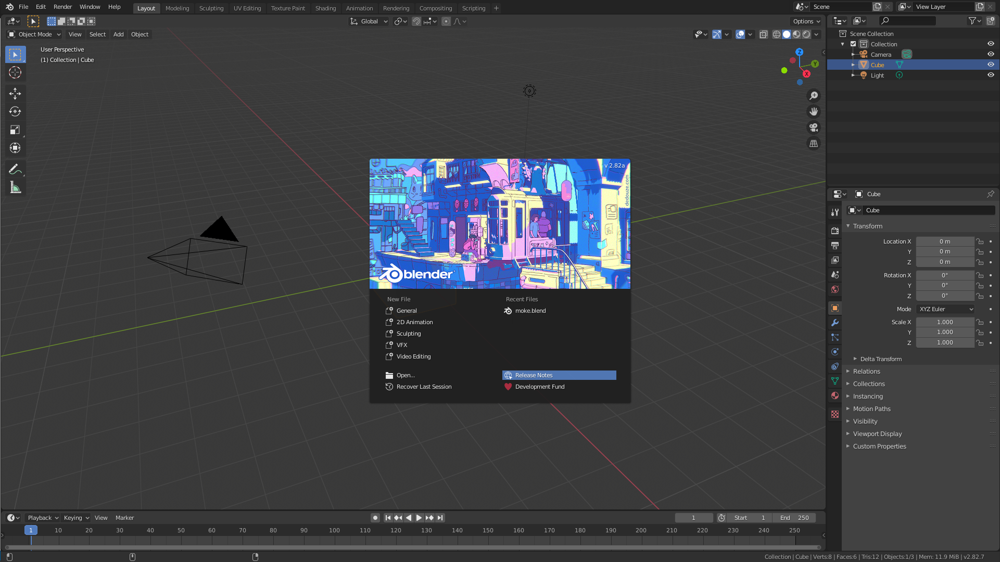

*When you open Blender for the **very** first time, you might get a screen asking you to set up some default settings. If you see that screen, just accept the default settings.*

You can either click outside of the menu in the middle or click the "General" option.

A helpful tip for Blender is that at any point in time, the actions that you can perform with your mouse are displayed on the bottom left of the screen.

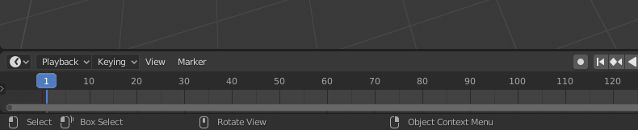

You'll notice that you can rotate the view with the middle mouse button. You can also zoom by scrolling the scroll wheel, and pan by holding shift and dragging with the middle mouse button.

You can also do these things with the widgets on the top right.

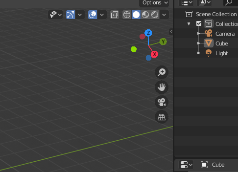

In the center of the 3D space, you will see the famous Blender default cube. While the default cube is great, we'll be using a more interesting shape.

Select the cube with the left mouse button (*if that doesn't work, use the right mouse button. You might have accidentally configured Blender this way*). You'll know it's selected when it has a glowing orange border. Press the `X` key on your keyboard to delete the cube.

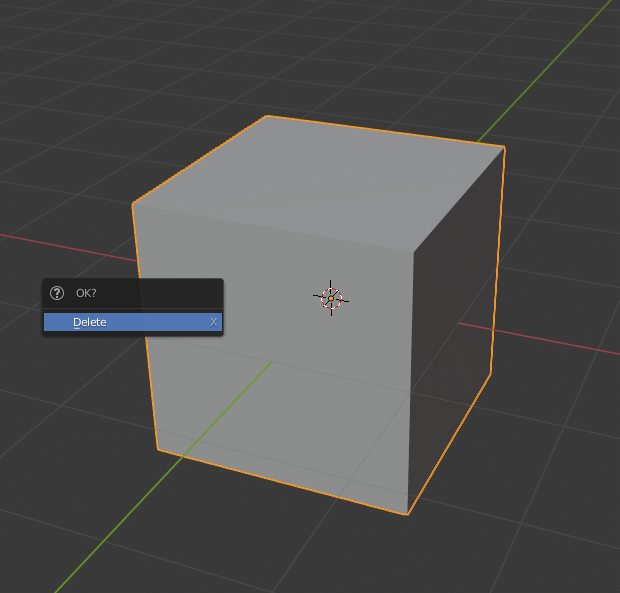

Now we will add a new shape by pressing `Shift + A` (`A` for "add"). Choose any shape you want, but I will be using an "Ico Sphere" because I think it looks cool.

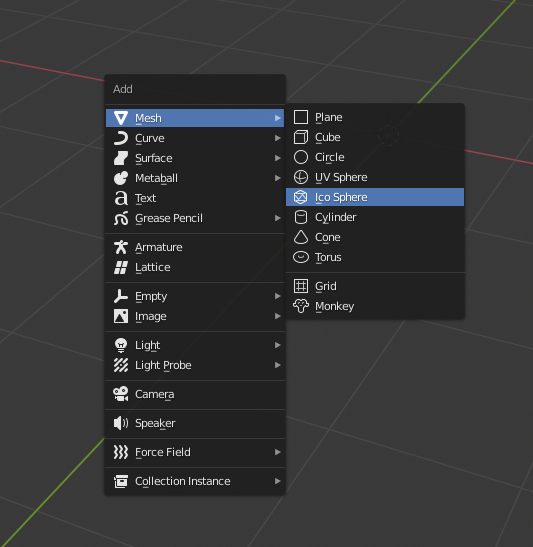

When adding certain objects, and additional menu will appear at the bottom left corner of the screen allowing you to change some parameters.

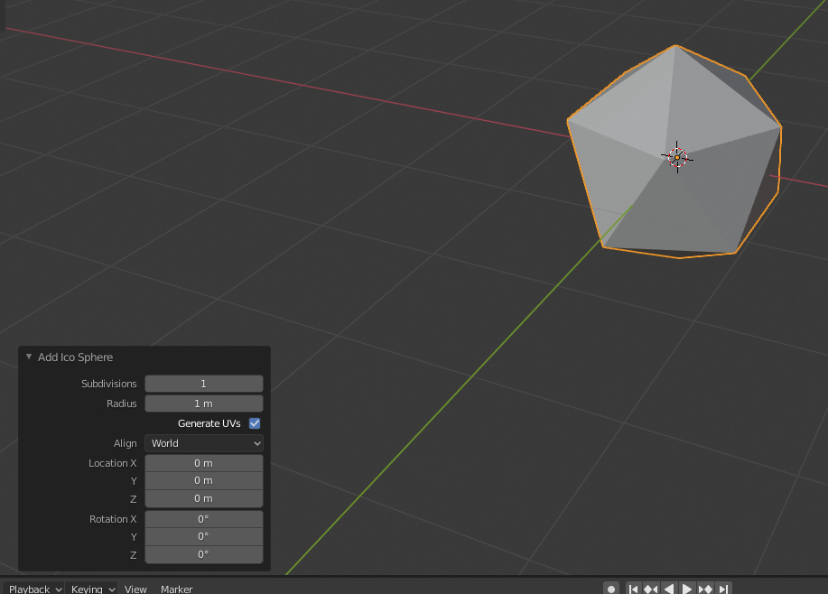

Mess with these until you have a shape that you like.

Now that we have our own shape, let's give it some character by giving it a color.

Select your shape, and on the right side of the screen, click on the Materials tab.

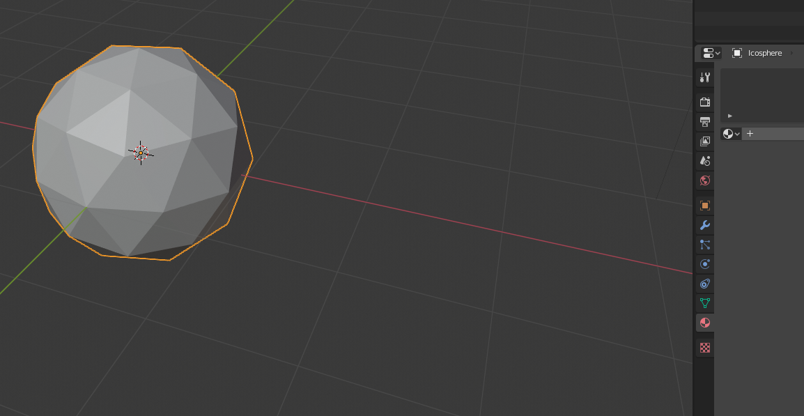

Click the "New" button to create a new material. A *lot* of options will pop up. A lot of them are fun, but we'll just be changing the base color. It might be helpful to expand the Preview tab that just appeared.

Click the white box next to "Base Color" and choose your favorite color.

The end result should look something like this:

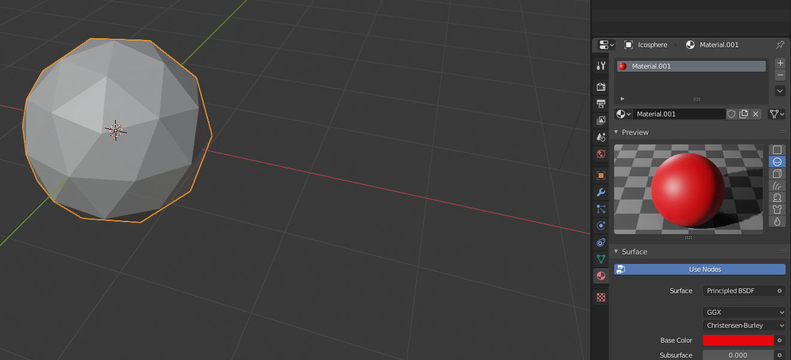

You might notice that your model didn't actually change color. This is because with the current view settings, materials aren't shown on models. If you want to confirm that your material works, press `F12` to render your model, or click the "Shading" tab on the top of the screen.

If something went wrong, don't worry about it and just move on to the next step.

Now that we have a custom model, it's time to animate it.

### Animating in Blender

Time to make some animations. Click the "Animation" tab at the top of the screen.

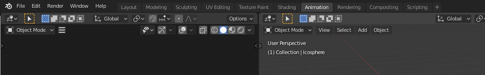

There is a lot of new information here. The top left viewport is the view of your camera. This is what would be seen in a final render of the scene. We don't need to worry about that for game asset creation. The bottom of the screen has the dope sheet, which displays all information about your animations.

We will create one or two simple animations.

In the dope sheet, using the button on the top left, switch its mode to "Action Editor". An "Action" is analogous to an animation. Similarly to how we had to create a new material, we now need to create a new action. Click the "New" button at the top middle of the dope sheet.

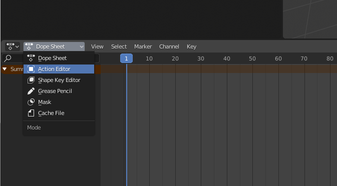
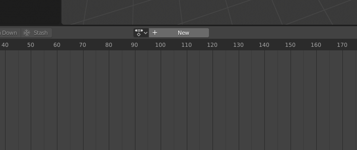

Name your animation. This is the name it will have in the game engine.

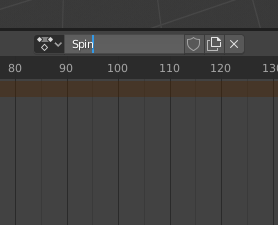

Shorten the length of the animation to something around 30 frames using the "End" box in the bottom right.

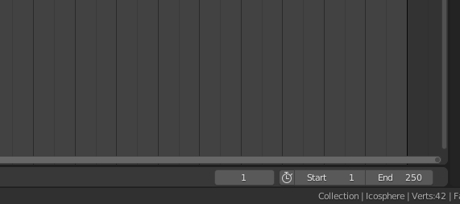
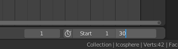

Now we can start animating!

A key difference between traditional 2D animation and computerized 3D animation is the use of keyframes.

In hand drawn 2D animation, each frame is drawn separately. The frames are then played back quickly in succession at a given framerate to give the illusion of movement.

For example, this is an animation of a little puff of smoke that I stole off of google images.

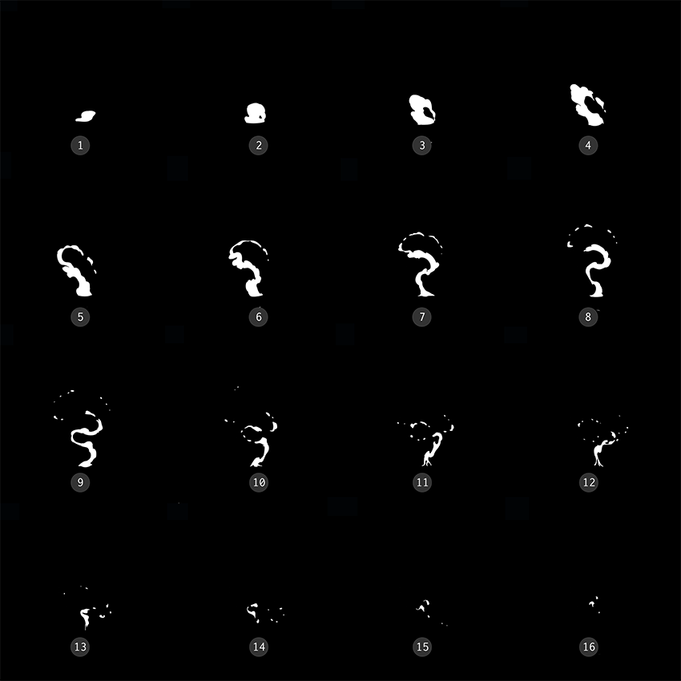

In 3D animation, there is still the idea of frames, but they are called keyframes. And the big difference is that they are used to mark **start points** and **end points** of individual properties of an object, and the computer calculates what belongs in between. The "framerate" of 3D animation is how frequently you can set keyframes. The "real" or "observed" framerate is essentially infinite, since the animation can be calculated at an arbitrary point in time in the sequence. You can use keyframes to animate position, rotation, scale, and pretty much anything else you can think of. This will make perfect sense when we actually animate something.

So let's do just that!

Back in Blender, make sure you are at the beginning of the dope sheet timeline. You can get there by clicking and dragging the top of the blue bar to zero.

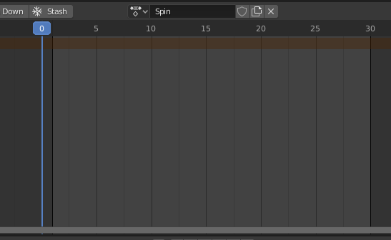

Select your model if it isn't still selected. With your mouse hovering in the viewport of your model (not the dope sheet), press `I` (for "`I`nsert keyframe"). You will get a big menu offering different properties to keyframe. Choose rotation.

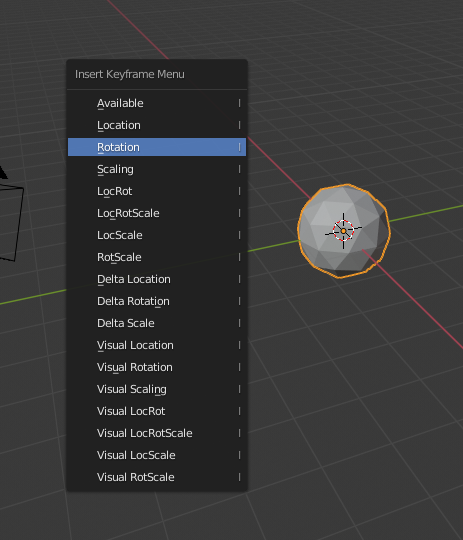

Now something has happened in the dope sheet. Some diamond symbols have appeared. Those are the keyframes. However, if we were to play our animation right now, nothing would happen. Remember, keyframes define **starting** and **ending** positions. Right now, we only have the starting position, and no ending position to move to.

Seek the position in the dope sheet to somewhere in the middle.

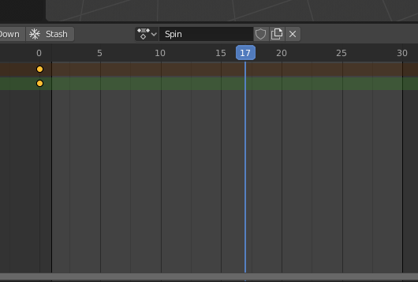

Select your model and press `R` (for `R`otate), then press `Z` to lock your rotation around the Z axis (up and down). Now type "360" and press enter. Your model will have rotated 360 degrees. Now insert another rotation keyframe.

Your dope sheet should look like this now:

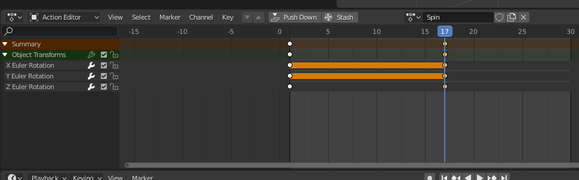

*You can expand the "summary" button on the left to see more info. You can see the exact properties that are being manipulated. A solid bar between two keyframes means there is no change. This makes sense, since we only rotated around the Z axis.*

If all goes well, you should be able to press the space bar or click the play button at the bottom on the dope sheet and see your animation!

You can define multiple animations in a single Blender file. This is useful for things like characters that have idle, walking, and running animations. 

To create a new animation, click the button next to the current animation name. It's tiny, but I tried to line up the blue seek line with it to help you locate it. It's the button with pieces of paper on it. Clicking it will actually duplicate the current action, so after duplicating, clear all the keyframes in the duplicate by selecting them and pressing delete.

To select which animation you want to edit at any given time, select the icon to the left of the animation name.

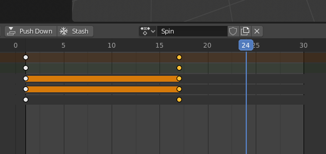

If you're ambitious, I encourage you to make one more simple animation so that you can see how multiple animations are handled in your game engine. A good candidate would be a simple hovering animation where the location of your object is moved up and down. 

If you aren't ambitious and just want to get this lab over with, you can just stick with one animation. :)

### Exporting From Blender

Luckily for us, exporting from Blender to Unity or Godot is pretty easy.

#### Unity

Unity users, you're in luck. You can just save your Blender project as a `.blend` file (Blender's default project file type) and import that directly into Unity. (Or so I'm told!)

#### Godot

Importing and exporting to Godot is a little trickier, but it's easy once you install the right Blender add-on.

Get the Godot blender exporter add-on here: https://github.com/godotengine/godot-blender-exporter. Follow the given instructions to install it.

Export your model as `.escn`, and make sure to include animations. Animations are enabled by default.

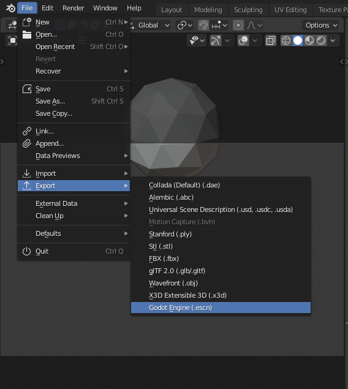

*If you don't see this export option, you did not install the add-on correctly or you forgot to enable it. Make sure you installed the files properly and that you have enabled the add-on. To enable the add-on go to Edit > Preferences > Add-ons. Search for "Godot" with the search bar and enable the exporter.*

You can configure exactly what you want to export with the buttons on the right. For now, just leave them as default.

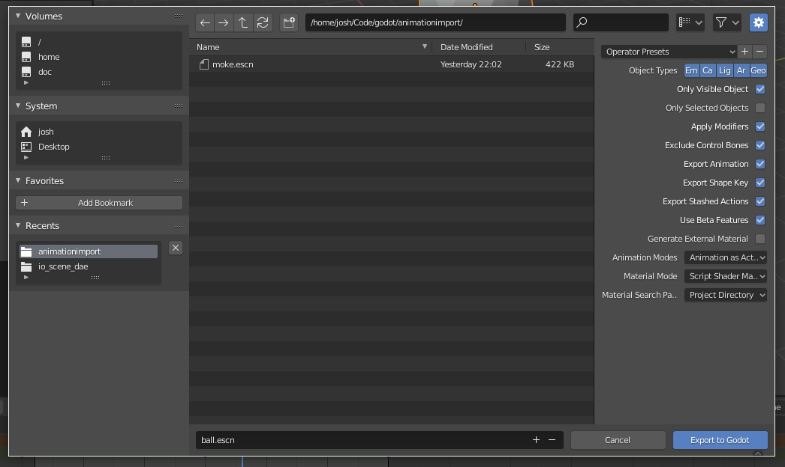

### Playing the Animation In Game

(This section will be from the perspective of Godot, but from what I can tell, the Unity process is very similar.)

After properly exporting your model, you should be able to basically drag and drop it right into your game engine. If you didn't export your model directly into your game's resource directory, import it.

In Godot, I just dragged and dropped `ball.escn` from the resources menu into the scene tree.
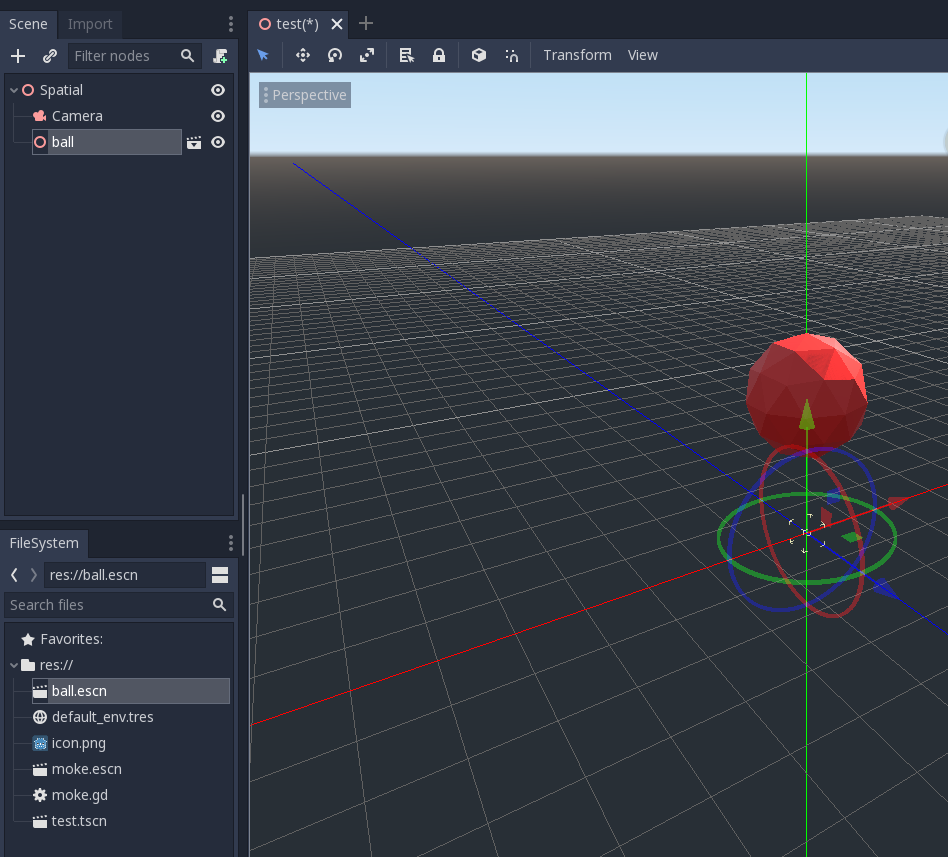

Because of how Godot handles inheritance, it won't let you change any parameters (including the current animation) on the imported model at first. What you need to do is right click the model in the scene tree, and click "make local". Now Godot has "instanced" this object and you don't have to worry about making global changes to every instance of your model.

Now you can see the model's children. You might notice that there's a light and a camera included. This can be changed in the export settings in Blender. Click on the animation player and change the "current animation" property. Now your model should move in the editor.

You'll notice the animation dock pop up on the bottom. It looks very similar to what you saw in Blender. In fact, you could make all the simple animations we did in Blender directly in Godot using very similar practices. 

There are two settings in the animation dock that you'll probably want.

First, by default, animations in Godot don't loop. You can set an animation to loop by clicking on the loop button in the animation dock when you're editing an animation.

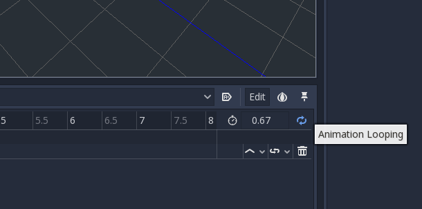

Second, if you actually run the scene, you'll notice that the selected animation in the editor doesn't actually play in game. To change this, you can call the animation via code or use the "Autoplay On Load" button in the animation editor. Obviously, only one animation can automatically play on load.

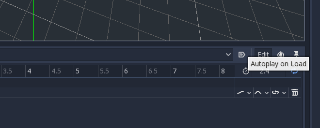

And that's it! You've successfully created a 3D model and imported it into your game.

### More Resources

We have just scratched the surface of 3D models and animation. There is so much more to cover that I couldn't fit in this lab. I encourage you to read the documentation for your favorite game engine to learn how to take it to the next level!

Here are some topics that you might find useful:

#### Armatures

We did some extremely basic 3D animations that consisted of moving the entire model at once. What about animating only specific parts? For example, to animate a character waving, you would only want to animate the arm.

If we stuck to the way in this lab, we could try to accomplish it by keyframing model vertices, position, rotation... etc. But there is a better way. Let the computer handle the nitty gritty and just tell it the general idea of what you want.

In *real life* 3D modeling, an armature is the "skeleton" of a model. It is the bones that support the modeling medium. To animate the character, you now just have to move the bones.

Stealing from google images again.

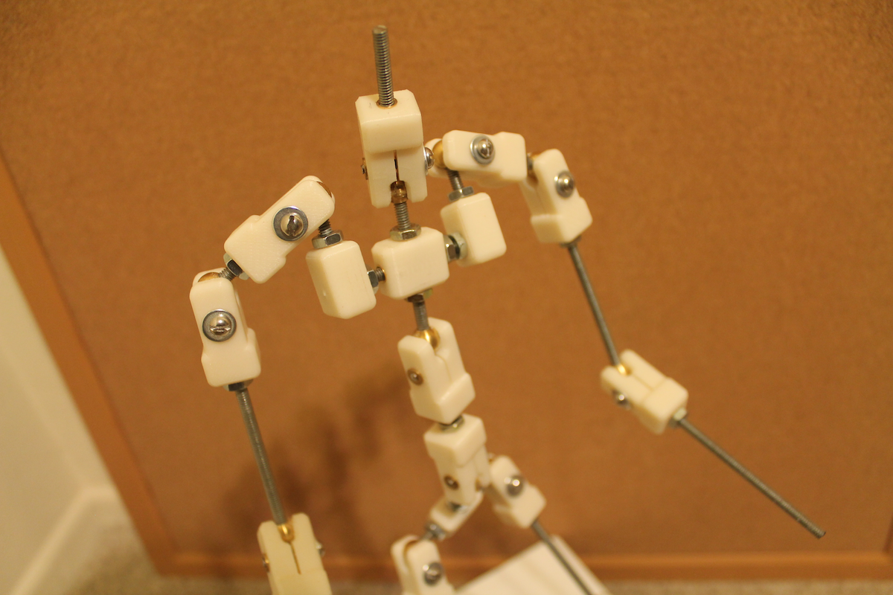

This idea has been implemented into 3D modeling software too. Applying an armature to a 3D model is called "rigging" and could be its own course. However, to get started, you can search up "blender armatures" and find plenty of resources.

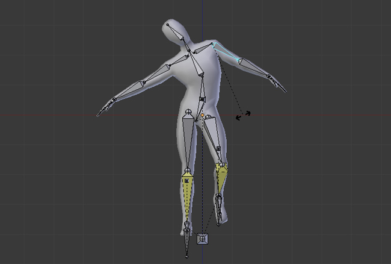

With an armature, you only need to keyframe the positions of the bones, and the model will bend and move to match them automatically (in a perfect world, at least... :))

#### State Machines and Blend Trees

When you build up a model with many animations, controlling which one plays at which time can get difficult. Both Godot and Unity have the idea of animation state machines and blend tries built in to them. Knowing how to use these makes controlling animations much easier. As an added bonus, they support the blending of two animations together. That's the "blend" in "blend trees".

As a quick example, often times you will have a character with a walk animation and a run animation. However, in your game, your character's speed smoothly transitions from walking speed to running speed, instead of being discrete like your set of animations. With blend trees, you can smoothly transition from one animation (walking) to another (running).

In Godot, blend trees and state machines are hidden away in a node called "AnimationTree". Here's the documentation: https://docs.godotengine.org/en/stable/tutorials/animation/animation_tree.html.

In Unity, blend trees and state machines are separate. You can start with the animation state machine documentation here: https://docs.unity3d.com/Manual/AnimationStateMachines.html.

#### Submission

As stated before, please submit some screenshots to the dropbox corresponding to this lab in elearning. Submit the following:

- A screenshot of your very simple model in blender
- A screenshot of your animation dope sheet in Blender
- A screenshot of your model in your game engine of choice
- A rough estimate of the amount of time it took you to complete this lab

This lab will be due next Friday at 3pm. Have fun!
