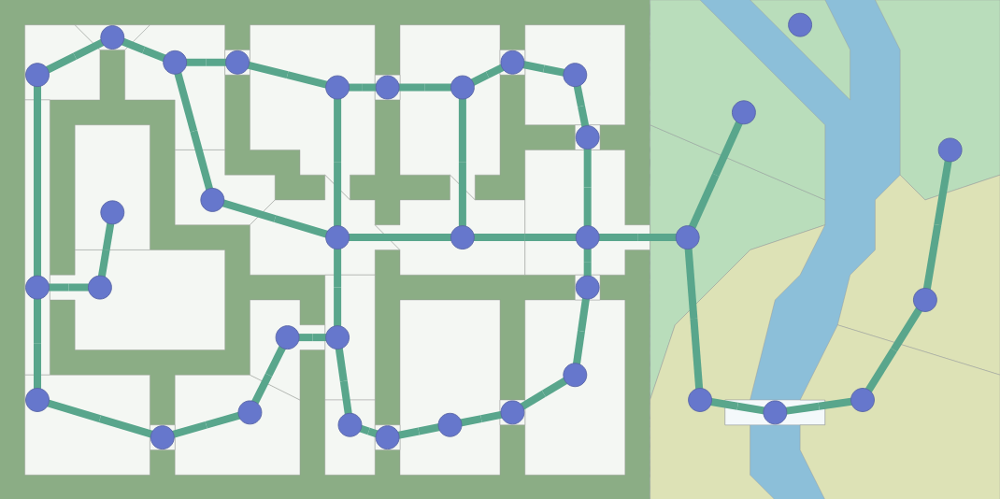
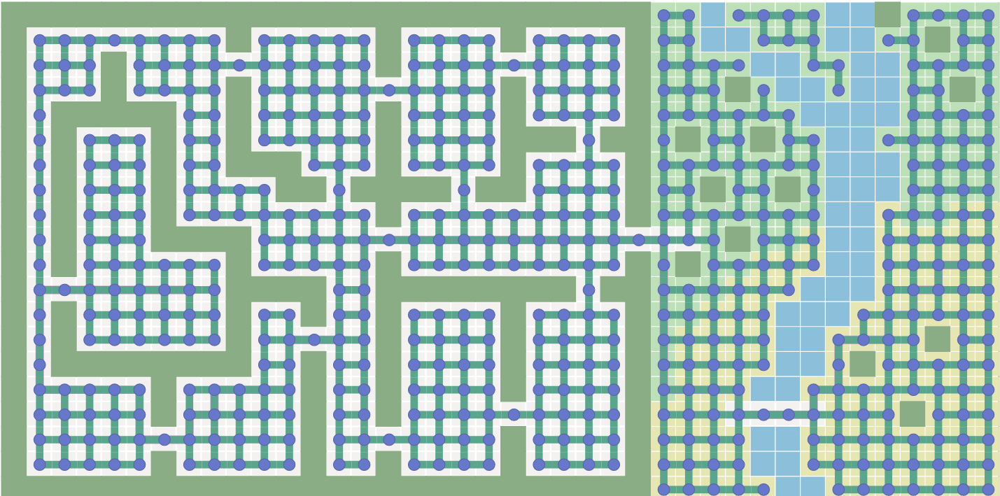
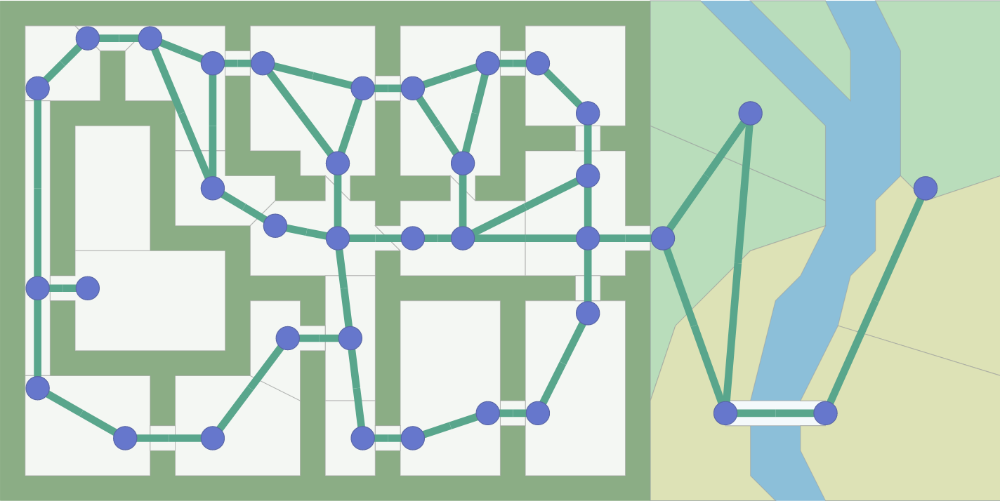
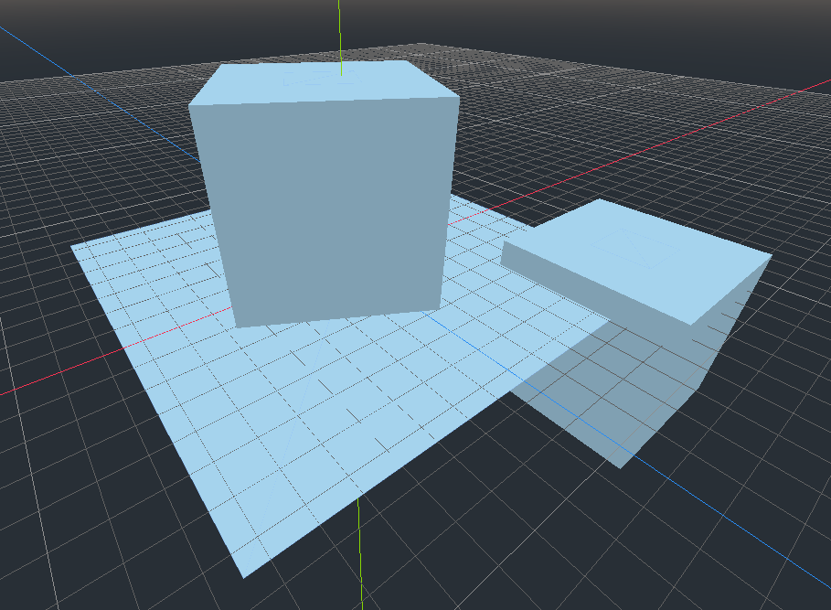
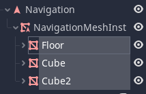
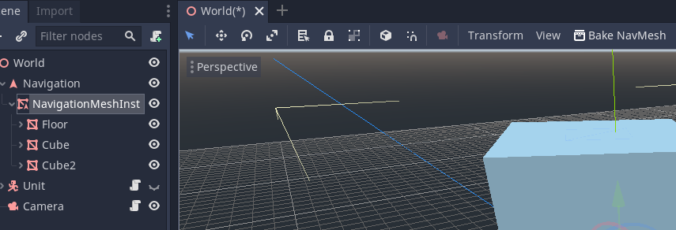
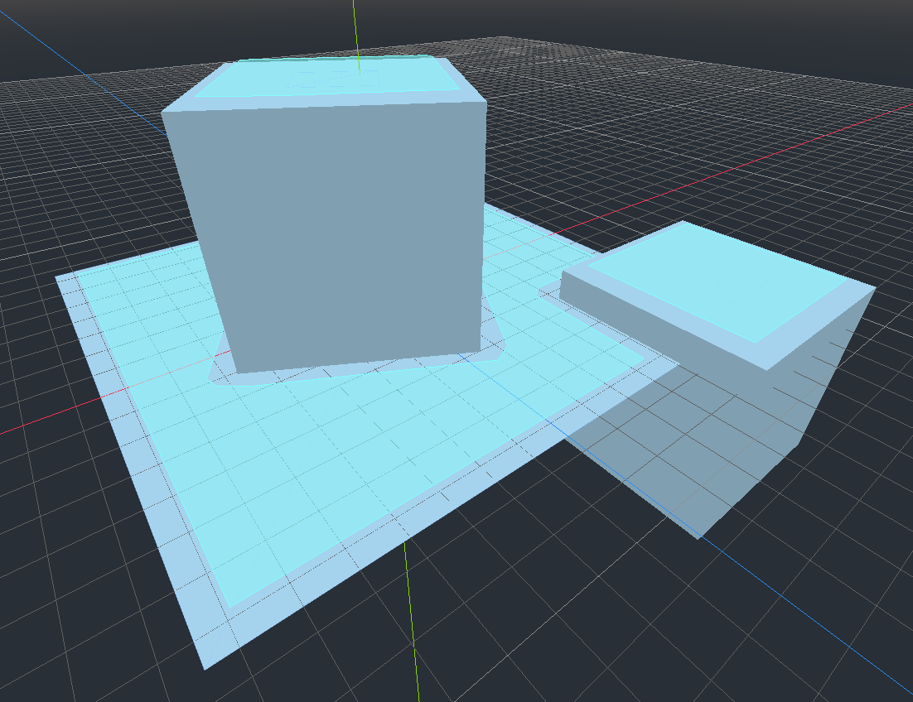
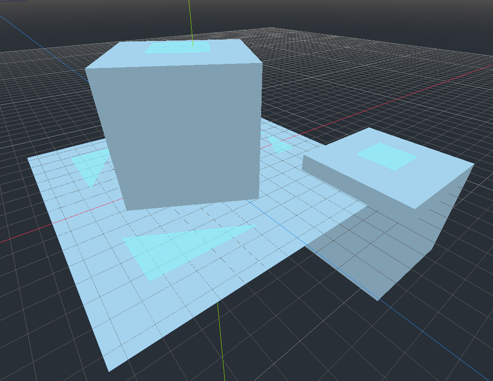
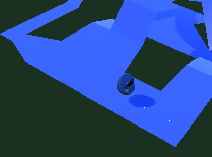

# Lab - Navigation Meshes

## Introduction

This lab will introduce you to how pathfinding can be done in games using both the A* algorithm and navigation meshes.

## What is Required From You

- Read the lab
- In the dropbox associated with the lab, just write a sentence or three about a small way you could incorporate pathfinding with navigation meshes or A* in your semester game project if you wanted to. If you already incorporate it, write about that instead.

## Graph Searching Algorithms

Often in a game, we come across a common problem. Move from position A to position B. In a perfect world, there would never be any obstacles in the way of a game object that wanted to accomplish this, but we don't live in a perfect world, and neither does the game object. In the real world, if we were faced with an obstacle in our path, we would just go around it. But, since we're talking about game development and programming, we need to somehow tell the game object exactly how to navigate. There isn't a "just go around it" function to call (Yet). 

How do we take the idea of "just go around the obstacles" and put it into code?

Remember **graphs** from foundations of computer science/discrete math? Often times, it makes intuitive sense to represent a game world as a graph. The nodes of the graph are positions you can be in, and the edges are ways you can travel to other positions.



Notice how the edges connecting nodes never go through a wall. That's because in our game, we can't travel through walls, so nodes with paths that would travel through walls aren't connected on the graph.

You can make the graph representing the map in many different ways. The key point to take away from it is that you need to *somehow* represent the map as a graph for graph searching pathfinding algorithms to work.

For example, you could turn the map into a grid:



Or you could make *doorways* edges:



Again, the bottom line is that the algorithms only see the graph, so make sure the graph you feed into the algorithms reflect the kind of path you want to find.

At this point, if you want to learn more theory behind graph searching algorithms, I'm going to point you to https://www.redblobgames.com/pathfinding/a-star/introduction.html, which is an amazing and interactive page that should get you some intuition for graph pathfinding algorithms. The page has tons of interactive examples that are way better than anything I could try to illustrate in a pdf. (It's also where I took those screenshots from..!). This page covers a few different algorithms and what they're good and bad at, including Dijkstra's and A*.

## Navigation Meshes

Now, the reason that I glossed over A* and other pathfinding algorithms so quickly is that most of the time, game engines will have better tools available to you! A common tool you see in both 3d and 2d is the navigation mesh (navmesh for short). With a navmesh, instead of representing the world as a graph, you represent it as a 3d mesh or a polygon, which is much more native to the setting of programming games. You give the navmesh the world geometry, bake it, and then you can use it to find paths from point A to point B!

I don't actually know the underlying theory behind navmeshes and how they work, but I know that they're amazing and useful, so here's how to use one.

I'll be using Godot, as usual, but I know Unity has navmesh capabilities too, and the core ideas should be the same.

The main thing you need to know about navmeshes is that you need to **bake** them. In game engines and similar areas, "baking" refers to *generating data from some source*. Usually baking is a computationally heavy task, so it's probably something you won't be doing every frame of your game. Instead, you bake your data once beforehand and then use that data for some task.

In a navmesh, baking refers to taking the 3d (or 2d) geometry from your game and generating the necessary data needed to be able to generate paths connecting any two points.

Let's look at a quick example.

In Godot, I've set up a tiny little 3d scene:



These are just a few MeshInstance nodes.

Now, to create a navmesh, I create a Navigation node and add a NavigationMeshInstance node as a child.


I temporarily move my MeshInstance nodes that make up the level geometry to be children of the NavigationMeshInstance node.



Now, I can select my NavigationMeshInstance and click on the "Bake NavMesh" option at the top of the editor.





Now I have a blue navmesh around my geometry! This illustrates where the algorithm has detected that an "agent" can walk.

Let's talk a little more about the **agent**. When baking a navmesh, imagine the agent as an imaginary character that walks around your level to determine what areas are reachable. Often you can configure this agent to fit your needs.

In Godot, I can change the height and radius of the agent. The height determines what things the agent can duck under, and the radius controls how close to walls the agent can get.

The above image was generated from an agent with a radius of 0.6. If I turn the radius up to 2, I get a much different navmesh.



Notice that since I increased the radius of the agent, the navigable area it finds is much farther away from the walls and ledges. Something using this navmesh would not be able to find a path between the highlighted "islands" (or outside of them) because they aren't connected.

Now that the navmesh is baked, I can move the nodes *in the scene tree* that make up the level geometry back to wherever I want them. If you modify the actual level geometry in any way, you need to re-bake the navmesh.

Now the Navigation node (the parent of the NavigationMeshInstance node) can be queried and return paths between two points with the `get_simple_path` function.

How does the `get_simple_path` function work? It take two arguments, a start point, and an end point. It returns an array of points in space that correspond to the calculated path.



The white dots are the points returned from a call to `get_simple_path`. This is from the Godot 3d navmesh example project, so you can check it out for yourself if you want.

Extremely simple code to follow the path might look like this:
```
func _physics_process(delta):
  # path_ind is "path index", the index in the returned array of points that we're 
  moving towards.
  if path_ind < path.size():
    # calculate the vector pointing towards our next waypoint
    var move_vec = (path[path_ind] - global_transform.origin)
    if move_vec.length() < 0.1:
      # if we're close enough, move to the next point
      path_ind += 1
    else:
      # move towards next point
      move_and_slide(move_vec.normalized() * move_speed, Vector3(0, 1, 0))
```

## Godot 4.0

A quick note: Godot 4.0 will have much better Navigation support, where you won't have to think about an array of points and most of the work is done for you. Also, you will have the ability to re-bake the navmesh *at runtime*, which currently is very difficult.

See this article if you're interested in the new features: https://godotengine.org/article/navigation-server-godot-4-0.

## Additional Resources

A good video that explains the basics of NavMeshes in Godot: https://youtu.be/_urHlep2P84

Videos about the Unity side of things:
Navmesh baking: https://youtu.be/VcNly-cMZV4
Navmesh agent usage: https://youtu.be/mP7ulMu5UkU