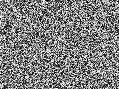
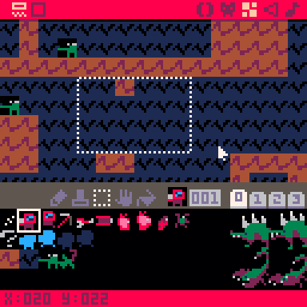

# Lab - Baby's First Procedural Generation

## Introduction

This lab will introduce you to the basic idea of procedural generation and the common tools used to implement it. It will cover:

- What procedural generation is
- How random numbers work in computers
- Noise
- Combining hand made and procedural content

I have also provided all example code used in this lab.

## What is Required From You

- Read the lab
- In the dropbox associated with the lab, just write a sentence or three about a small way you could incorporate procedural generation in your semester game project if you wanted to. If you already incorporate it, write about that instead.

## What is Procedural Generation?

Procedural generation is simply generating game content with code instead of a human. That's the "procedure" in procedural.

By far, the most common use case of procedural generation is using it to generate huge amounts of content without having to painstakingly create the content by hand. For this reason, randomness is almost always used in procedural generation. After all, there wouldn't be much point in writing a program to generate content if it generated the same content every time.

Examples of things procedurally generated in games include terrain, maps, dungeons, weapons, missions, and more. Procedural generation can be applied to almost any aspect of a game.

If procedural generation can be applied so widely, why don't we have entire games that are procedurally generated? The answer is that the hardest part about procedurally generating content is making it still *look* like a human (or some other natural process, in the case of things like terrain) did it. In this lab, you will learn about techniques used to solve this problem.

## How Randomness Works in Computers

Since procedural generation relies so heavily on randomness, it's good to know how computers actually produce randomness.

The truth is, computers *can't* produce randomness. It's just not how computers work. Computers can *only* follow a premade set of instructions. You can't actually tell a computer to pick a random number between 1 and 10 because a computer can't make that independent decision on its own. If you've taken CS 2230, let me ask you this: what would a "pick a random number" program look like in assembly? And I promise that there isn't a magical assembly instruction that can do it. ;)

Bottom line: it's impossible for a computer to be *truly* random.

After reading that, you might be thinking "wait a minute, in my game engine I can just call `randInt(1, 10)` and get a random number back. And it's true, you can! For game creation purposes, the number you get back will be random. But what's actually happening is you're getting back a **psuedorandom** number. When you call `randInt(1, 10)` five times, the computer's job isn't to make a sequence of five *truly* random numbers, just a sequence of five numbers that *look* random.

So how does it accomplish that?

Under the hood, to generate a random number, a computer calls a function that looks something like this:

```
int generateRandomInteger(int seed) {
    int random_number;
    ... magically come up with a random number ...
    return random_number;
}
```

For now, assume function `generateRandomInteger` does what its name says it does. When you call it, despite everything I just said, a random integer is returned. 

But- notice that it also takes an argument. That's a little strange. In some game engines, you can pass an argument to the `random()` function which represents the maximum number that can be returned, which is useful because when generating random numbers, you almost always want an upper bound. However, that isn't the case here. As the variable name suggests, the argument is the **seed** of the random number operation.

In reality, instead of magically coming up with a random number, the computer takes the **seed** as input, and does some pretty arbitrary (but always the same) math operations to it, and spits out the result. What exactly is done to the seed varies between techniques, but there are almost always bitwise operations happening, because the results of them are hard for humans to predict intuitively. This fools the human into thinking that the input and output are unrelated.

With this knowledge, we can make our own very very basic random number generator in python:
```python3
# the numbers used in this function are (almost) completely arbitrary.
# an explanation about chosing the numbers will come later.
def my_random(seed):
    return ((seed*0x37) ^ 0x75)

# the purpose of the bitmask is explained later.
# for now, just know that it keeps the output under 16.
def my_random_with_mask(seed):
    return my_random(seed) & 0xF

for i in range(16):
    print(i, "->", my_random_with_mask(i))
```

Here's the output:

```
0 -> 5
1 -> 2
2 -> 11
3 -> 0
4 -> 9
5 -> 6
6 -> 15
7 -> 4
8 -> 13
9 -> 10
10 -> 3
11 -> 8
12 -> 1
13 -> 14
14 -> 7
15 -> 12
```

Looks pretty random! To prove my point, if I only gave you the first 4 results...

```
0 -> 5
1 -> 2
2 -> 11
3 -> 0
```

..and then asked you what will be the result of using 4 as an input would be, you probably wouldn't be able to tell me.

Let's look at what the code is actually doing. It's actually pretty simple. Just two operations (three if you include the bitmask at the end, not shown below).

```
return ((seed*0x37) ^ 0x75)
```

So all we're doing is multiplying the seed by a relatively big number (`0x37` in this case, which is 55 in decimal) and xor'ing the the result with a different big number (`0x75` is 117 and `^` is the xor operator)

The core idea behind this technique is "multiply the input by a big number so the human can't immediately recognize the result, and then take *that* and xor it with an arbitrary number to make it even less recognizable".

In the example code, I included a bitmask (the `& 0xF` at the end of the second function) to mask the output result down to something under 16. If you know your bitwise operators, you'll know that and'ing a number with `0xF` (decimal 15) has the exact same effect as running it through modulo 16. In other words, in code...

```
number & 0xF == number % 16
```

If I didn't mask the output, the results of the random function would be a lot bigger.

```
# results of the random function without the mask at the end
0 -> 117
1 -> 66
2 -> 27
3 -> 208
4 -> 169
5 -> 358
6 -> 319
7 -> 500
8 -> 461
9 -> 410
10 -> 595
11 -> 552
12 -> 737
13 -> 702
14 -> 887
15 -> 844
```

The reason I masked the output was because a computer has a maximum amount of storage space that it can use for a number. If you took CS 2230, this might sound familiar. In modern systems, usually an integer is 32 bits long. That means the biggest unsigned integer a 32 bit system can store is 4,294,967,295, which, in binary, is represented by 32 1's in a row. I simulated a system that could only store numbers 4 bits long to make understanding the process easier, but know that usually that mask is actually a result of hardware limitations and much bigger numbers are involved. In your computer, the "mask" is probably `0xFFFFFFFF` (the number i just mentioned in hexadecimal).

Now we can put it all together. Up until now, we were still talking about random functions that accept a seed as an input. In game engines, you don't have to provide a seed. So how is it all set up?

Look at the output of our random number generator and notice something. Each input number maps to a unique output number. The only number that outputs 5 is 0, and the only number that outputs 3 is 10. In math terms, this means our function is a **bijection**. This is a neat side effect of the "multiply and then xor" technique and means that we can string everything together to make a looping sequence.

```
# the previous output shown again for convenience
0 -> 5
1 -> 2
2 -> 11
3 -> 0
4 -> 9
5 -> 6
6 -> 15
7 -> 4
8 -> 13
9 -> 10
10 -> 3
11 -> 8
12 -> 1
13 -> 14
14 -> 7
15 -> 12
# Note: for this to work like this and give each number a unique mapping, the 
# big number you multiply by and the number you use for xor must both be odd.
```

With this property, we can set up a random number generator where we don't have to think about the seed.

```
seed = 0

def my_random():
    global seed
    result = my_random_with_mask(seed)
    seed = result
    return result

def my_random_with_mask(seed):
    return ((seed*0x37) ^ 0x75) & 0xF

for i in range(16):
    print(my_random())
```

So now, we start with a global seed, and whenever we first call `my_random` we use it (without the user having to provide it themselves). Then, before returning the result, we *set a new seed using the result of the random function*, so the next time that we call `my_random`, we'll get a new number. Here's the output of the new code:

```
5
6
15
12
1
2
11
8
13
14
7
4
9
10
3
0
# at this point, the global seed is set to 0 again, so the sequence will repeat itself.
```

This is what happens in games that let you specify a seed to generate a random world. Since the random sequence is always the same with the same starting seed, you'll always get the same world. Games like Minecraft let you enter a word as a seed, but in reality they just convert that word into some number before using it as as seed.

This is also why in some game engines you need to call something like `randomize` or `srand`. They use something that will be different every time the program is run, usually the system clock, to choose a seed value that wasn't used last time the program was run.

That was a lot of explanation for how a simple call to `random` works. In actual games/libraries, the technique to produce a random number is much, much more complex than just two mathematical operations, but they all still need a starting seed. The main takeaway from this is that computer randomness is actually completely deterministic and completely dependent on the starting seed.

And as a fun fact, the following is the procedure that Super Mario 64 used to create random numbers. It's a little more complex than our example, but you can still see some common patterns in it. This one doesn't actually cycle through each possible number perfectly once, but it gets *most* of them.
```cpp
unsigned short mario64rng(unsigned short input) {
   unsigned short a;
   unsigned short b;

   a = (unsigned char)input << 8;
   a ^= input;
   input = ((a & 0xFF) << 8) | ((a & 0xFF00) >> 8);
   a = ((unsigned char)a << 1) ^ input;
   b = (a >> 1) ^ 0xFF80;
   if ((a & 1) == 0)
      input = b ^ 0x1FF4;
   else
      input = b ^ 0x8180;

   return input;
}
```

Websites like random.org pride themselves in being "more random" than traditional computer methods since they derive their random numbers by sampling atmospheric noise instead of a computer process. This is also why we can't draw lottery numbers by just asking a computer to do it. Computers aren't random, so if you somehow learned the seed of the random number generator that would be used to draw numbers, you could know exactly which numbers would be picked.

## Just Call `random`, It's That Easy

That's all there really is to it to get started with procedural generation. When creating parts of your game, use a call to `random` to pick an attribute instead of using something hard coded.

If you wanted to have some variation on the maximum health a monster has, a call to a random generator function would get the job done. If course it does, because you're generating random *numbers*, and generating numbers is very easy. It gets a little more difficult when you want to generate more than just numbers. You can't generate convincing looking terrain or levels by just setting every block or tile to a random value. That's where more "sophisticated" methods of randomness come in.

## Noise

Random noise is a common tool used in creating procedurally generated content, especially terrain.

Noise is commonly represented as a 2D image because it's easy to visualize that way. Here is a sample of completely random noise:



This image was created by applying a random value to each pixel. Pretty simple.

While this image is pretty cool, it's really no different than what we had before. Before, we could call a function to generate a random number, and all we've done now is arrange a bunch of those numbers together in a square (ish). It doesn't really look like anything meaningful yet.

The big problem with this noise is that it's not continuous. One pixel's value has no effect on the pixel value next to it. Say we were generating terrain. Terrain is (more or less) continuous, so this wouldn't work out.


*If we tried to use random noise as a heightmap (more on that later), it would look pretty bad.*

Luckily for us, there are *different kinds of noise* we can use, and some of them are continuous.

Perhaps the most famous continuous noise function is Perlin noise or its very similar and updated cousin, Simplex noise. A lot of game engines will have functions based around these types of noise built in. They look something like this:


*This is the built-in simplex noise in Godot.*

Looks a lot more coherent! This is a lot more promising for terrain.

We can make some very very basic terrain by simply taking this image and using it as a heightmap. Bright pixels are higher, and dark pixels are lower. To create this terrain, all I did was generate some simplex noise, and used the data to construct some geometry.


*Some simplex noise and the terrain that results from it.*

While this is a good start, it's pretty boring. How can we add some more details? The answer is *more noise* at different **frequencies**. In a nutshell, frequency determines how "fine grained" the resulting noise looks.


*Noise with a higher frequency and the terrain that results from it.*

While this terrain is certainly more detailed, it still kind of looks terrible. We're almost taking a step back towards the random noise terrain.

The trick is that we can generate multiple *layers* of noise and simply add the resulting numbers together to create detail. Each layer applied is called an **octave**.


*This noise has 4 octaves. Each octave has a higher frequency than the last, but its overall strength is less.*

At this point, we have some pretty basic, but still okay-looking terrain. It still could be better. For example, this method won't generate overhangs or caves to explore. But those issues can be fixed by using other kinds of noise, or non-noise techniques.

Side note: while all of the examples here have been examples of 2D noise, noise can be generated in any number of dimensions. Some 3D terrain generation techniques use 3D perlin noise, for example.


At the end of the day, noise is just a way of generating random numbers again, but in a more orderly (but still random) fashion. In practice, you generate some noise and "sample" it at a given point and get a random number back. So you're just still dealing with numbers, but this time there are guarantees about what neighboring values might look like.

There are also other kinds of continuous noise functions. This one, which is created by sprinkling some absolute values into the noise function, might be used for generating caves in a 2D game.


If you want to read more about generating terrain with noise, this interactive article is a very good read: https://www.redblobgames.com/maps/terrain-from-noise/.

## Combining Hand Made Content Procedurally

As I mentioned near the beginning of this lab, making procedurally generated content look hand-make is *pretty hard*. While Simplex noise can tackle some problems, there are still a lot of others that it can't.

Simplex noise might be good at generating natural looking outdoor scenes, but what if you wanted to generate a level that takes place in a city or a building?

A common technique to address this is to create a bunch of small, modular pieces, and put them together in a random fashion.

Here are a few some examples of ways that can be done.

### Spelunky

If you want to talk about building levels from hand-made pieces procedurally, you have to talk about Spelunky at some point.

Each level in Spelunky is made of a 4 x 4 grid of smaller "rooms". Each of these rooms is randomly picked from a big list of possibilities and then placed into the level. Each of these possibilities was hand made beforehand, but are *arranged* in a random way. There is a little bit of extra work done to ensure that there is always a path to the exit, and then the level is created!


*This is an image of Spelunky Classic, the original free version of the game. It still uses the same level generation technique as the new game, more or less.*

For more info on Spelunky generation, check out this video: https://youtu.be/Uqk5Zf0tw3o

### Unnamed Mining Game

Time for a little self promotion. :)

In a pico-8 game I am currently working on, I generate caves inhabited by monsters for the character to run around in.


Instead of trying to generate caves from noise (which is perfectly doable!), I wanted something more hand-made.

First, the world is completely filled in with solid blocks. Then, on the pico-8 map screen, I've drawn a sort of giant cave structure by hand.


Now, during level generation, the game randomly selects a small portion of this giant cave structure and "stamps" it into the game world.




It does this a bunch of times, and then I have a cave. One thing to note about this is that it does not guarantee anything about things like every area being reachable. To compensate for this, the player can dig through any block and has a jetpack, which allows them to get to any position they might want to be in.

This allows me to relatively easily adjust how dense or open the generated caves are. I also place enemy spawn points in the map this way, so I can easily change how commonly enemies spawn by adding/removing enemies.

There are lots of clever ways you can combine hand made assets into new experiences.

## Additional Cool Topics
### Cellular Automata

Another common technique for generating caves.

https://youtu.be/v7yyZZjF1z4


### Wave Function Collapse

A very cool algorithm where you can provide an image as input, and the algorithm will generate something that's *like* that image as output.

https://github.com/mxgmn/WaveFunctionCollapse


### Markov Chains

Special kinds of state machines that are useful in generating text.

https://en.wikipedia.org/wiki/Markov_chain


## Image sources

Wikipedia article on white noise: https://en.wikipedia.org/wiki/White_noise

Red Blob Games article on terrain generation with noise: https://www.redblobgames.com/maps/terrain-from-noise/

"My Adventure with 3D Perlin Noise: https://www.youtube.com/watch?v=TZFv493D7jo

A tutorial on how to use a specific noise library to make Minecraft-like worlds: http://accidentalnoise.sourceforge.net/minecraftworlds.html

Spelunky Level Generation: https://takenapeveryday.wordpress.com/2016/04/14/spelunky-level-generation/
